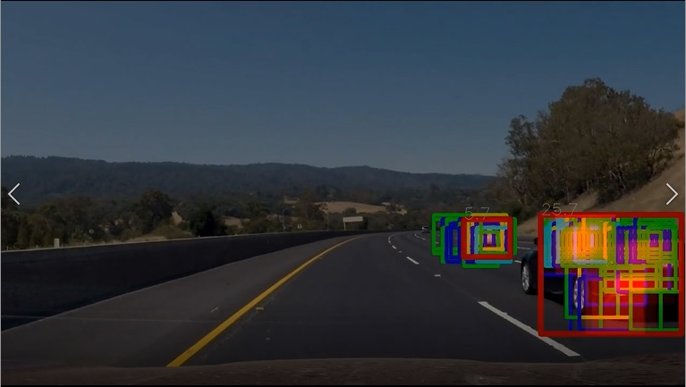

## Writeup Template
### You can use this file as a template for your writeup if you want to submit it as a markdown file, but feel free to use some other method and submit a pdf if you prefer.

---

**Vehicle Detection Project**

The goals / steps of this project are the following:

* Perform a Histogram of Oriented Gradients (HOG) feature extraction on a labeled training set of images and train a classifier Linear SVM classifier
* Optionally, you can also apply a color transform and append binned color features, as well as histograms of color, to your HOG feature vector. 
* Note: for those first two steps don't forget to normalize your features and randomize a selection for training and testing.
* Implement a sliding-window technique and use your trained classifier to search for vehicles in images.
* Run your pipeline on a video stream (start with the test_video.mp4 and later implement on full project_video.mp4) and create a heat map of recurring detections frame by frame to reject outliers and follow detected vehicles.
* Estimate a bounding box for vehicles detected.

[//]: # (Image References)
[image1]: ./examples/car_not_car.png
[image2]: ./examples/HOG_example.jpg
[image3]: ./examples/sliding_windows.jpg
[image4]: ./examples/sliding_window.jpg
[image5]: ./examples/bboxes_and_heat.png
[image6]: ./examples/labels_map.png
[image7]: ./examples/output_bboxes.png
[video1]: ./project_video.mp4

## [Rubric](https://review.udacity.com/#!/rubrics/513/view) Points
### Here I will consider the rubric points individually and describe how I addressed each point in my implementation.  

---
### Writeup / README

#### 1. Provide a Writeup / README that includes all the rubric points and how you addressed each one.  You can submit your writeup as markdown or pdf.  [Here](https://github.com/udacity/CarND-Vehicle-Detection/blob/master/writeup_template.md) is a template writeup for this project you can use as a guide and a starting point.  

You're reading it!

#### 2. The Videos
The resulting video is [processed.mp4](https://github.com/jacquestkirk/CarND_VehicleDetectionAndTracking/blob/master/processed.mp4)

A fully annotated version of the video is also provided as [processed_annotated.mp4](https://github.com/jacquestkirk/CarND_VehicleDetectionAndTracking/blob/master/processed_annotated.mp4) if you would like to see the intermediate steps. 

#### 3. This is not in the rubric, but I wanted to provide a description of my code before getting started. I used an Object Oriented approach to this lab, so it can be hard to follow without an appropriate roadmap. 
- [**script_to_run.py:** ](https://github.com/jacquestkirk/CarND_VehicleDetectionAndTracking/blob/master/script_to_run.py) This is the script to run in order to start training and processing videos. It calls all of the other functions for you. On line 7, the train variable states whether or not you want to run through the training data. If not, it pulls pre-calculated training results from a pickle file. Lines 8-11 describe the features you want to extract and train on. 
- [**Parameters.py:**](https://github.com/jacquestkirk/CarND_VehicleDetectionAndTracking/blob/master/Parameters.py) All the paramaters are stored in this file so they can be accessed from one common place. In this file, you can change parameters for the following. 
  - histogram
  - spatial binning
  - HOG features
  - Search settings (sliding windows to use and thresholds for valid detections)
  - Annotation settings (draw output with sliding windows, heat maps, or car bounding boxes)
- [**FeatureExtractor.py:**](https://github.com/jacquestkirk/CarND_VehicleDetectionAndTracking/blob/master/FeatureExtractor.py) This classes transforms image sapces and extracts features from images. It is called by both the Trainer class and Tracker class (both described below) to extract features in a similar manner. 
- [**Trainer.py**:](https://github.com/jacquestkirk/CarND_VehicleDetectionAndTracking/blob/master/Trainer.py) Trains a SVM classifier on the car and not-car data. This class is responsible for the following: 
  1. Using the glob library to pull references for all training images. (Trainer.buildTrainingSet())
  2. Using FeatureExtractor.py to extract features (Trainer.extractFeatures())
  3. Training the SVM. (Trainer.train())
 - [**Tracker.py:**](https://github.com/jacquestkirk/CarND_VehicleDetectionAndTracking/blob/master/Tracker.py) The video processing pipleine. Which consists of the following: 
   1. Find bounding boxes (Tracker.findBoundingBoxes())
   2. Generate heatmap and labels (Tracker.generateHeatMap() and Tracker.generateLabels())
   3. Annotate the image with visualizations (Tracker.annotate())

### Histogram of Oriented Gradients (HOG)

#### 1. Explain how (and identify where in your code) you extracted HOG features from the training images.

I would have preferred to use the same code for extracting HOG features for training and video processing. Since I wanted to use HOG sub-sampling window search for the video processing pipeline, however, I ended up having to write two seperate functions in order to increase processing time efficiency. The second best thing I could do was pull settings from the same set of parameters, so the arguments for calculating HOG features can be found in [Parameters.py](https://github.com/jacquestkirk/CarND_VehicleDetectionAndTracking/blob/master/Parameters.py) under Parameters.HogSettings

The code for extracting features lives in [FeatureExtractor.py](https://github.com/jacquestkirk/CarND_VehicleDetectionAndTracking/blob/master/FeatureExtractor.py). The HOG features specifically are calculated in FeatureExtractor.get_hog_features for training. 

For the image processing pipeline, the HOG features are calculated using featureExtractor.preCalculateHogFeatures(). The full HogFeature set is then subsampled based on windows in the Tracker.findBoundingBoxes() function in [Tracker.py](https://github.com/jacquestkirk/CarND_VehicleDetectionAndTracking/blob/master/Tracker.py)

#### 2. Explain how you settled on your final choice of HOG parameters.

How did I settle on these parameters? Honestly I just started with the choices that were made in the lessons. When I ran the classifier on the training set I got an accuracy of 99.2%. This seemed pretty good. So I didn't try to optimize any further. The YCrCb color space is a good set to use because it has channels that are invariant to lighting conditions. This is important because shadows and angles can cause various lighting conditions when driving. All features used the same image space so that I did not have to do multiple image space conversions when processing video.  

The features I ended up using are shown in lines 9-11 of [script_to_run.py ](https://github.com/jacquestkirk/CarND_VehicleDetectionAndTracking/blob/master/script_to_run.py). And parameters are chosen in [Parameters.py](https://github.com/jacquestkirk/CarND_VehicleDetectionAndTracking/blob/master/Parameters.py). But for convenience the features I chose to use are: 
- HOG features in YCrCb color space:
   - orient = 9
   - pix_per_cell = 8
   - cell_per_block  = 2
   - feature_vec = False
- spatial binning in YCrCb color space: 
   - new_size = (32, 32)
- histogram in YCrCb color space:
   - bins = 32
   - range = (0,256)

#### 3. Describe how (and identify where in your code) you trained a classifier using your selected HOG features (and color features if you used them).

Training is done using the Trainer class in [Trainer.py](https://github.com/jacquestkirk/CarND_VehicleDetectionAndTracking/blob/master/Trainer.py).

I used glob to pull all the car and not-car data from the training set using my Trainer.buildTrainingSet() function. 

The training itsself happens in Trainer.train. I extracted all the features (described in question 2) from the image using FeatureExtractor.findAllFeatures(). These features were compiled into two large matrices: Trainer.carFeatures and Trainer.notCarFeatures. These are stacked, scaled, and split into training and validation sets. I fit the data using sklearn's LinearSVC function(). Then I checked the accuracy of the validation set to make sure the my fit worked well. 

It worked well with 99.2% accuracy so I decided to move on to the next step. 

### Sliding Window Search

#### 1. Describe how (and identify where in your code) you implemented a sliding window search.  How did you decide what scales to search and how much to overlap windows?

The sliding window search is implemented in [Tracker.py](https://github.com/jacquestkirk/CarND_VehicleDetectionAndTracking/blob/master/Tracker.py) in Tracker.findBoundingBoxes(). Parameters for the search are found in [Parameters.py](https://github.com/jacquestkirk/CarND_VehicleDetectionAndTracking/blob/master/Parameters.py) under Parameters.SearchSettings. 

I prefered larger scales since they tend to have less false positives and take less time to search the image. I weighted these windows heavily in the heatmap to show this preference. The larger scales, however, do not detect cars well when they are much smaller than the window, probably because the cars in the training data come close to taking up the whole window. So I had to throw some smaller scales in the mix. I limited the smaller scales to the section of the image where cars are further away to avoid false detections close by and to decrease processing time. They, however were weighted less to counteract the high rate of false positives. Further away regions also required smaller overlaps since a single step can represent large distances when far away. 

I ended up checking 4 scales: 
- scale = 1.75:
  - weight = 6
  - y range = 400 to 656
  - cells per step = 2
- scale = 1.5:
  - weight = 3
  - y range = 400 to 656
  - cells per step = 2
- scale = 1.25:
  - weight = 0.5
  - y range = 400 to 500
  - cells per step = 2
- scale = 1:
  - weight = 0.5
  - y range = 400 to 500
  - cells per step = 1

#### 2. Show some examples of test images to demonstrate how your pipeline is working.  What did you do to optimize the performance of your classifier?

I tested the pipleine on the short test video test_video.mp4. Some sreenshots from that can be found below **add this**

I did numerous things to try to reduce false positives:
- **Heatmaps:** 

     I used a heatmap to combine multiple windows. Areas with high amounts of overlap are considered a good detection. I thresholded the heatmap to eliminate weak detections. These are calculated in Tracker.generateHeatMap(). Labels can be generated from these heatmaps using Tracker.generateLabels. 
- **Weight heatmap contributions:** 

	Smaller scales seemed more likely to pick up false positives so I weighted these less than larger scales. It can still be a correct detection if a bunch of small scale stack up. But a small scale off by itsself is unlikely to trigger a detection. This is seen in the the scale selections in Parameters.SearchSettings.searchWindowList.
- **Use svc.decision_function() instead of svc.predict() and threshold the output of the decision function:** 

	The search window parameters in Parameters.SearchSettings have a svmThreshold variable. It filters out bounding boxes that have a decision function less than that threshold. This helps to rule out weak detections. The confidence is also multiplied by the weight when deciding how much heat to add to the heatmap. That way more confident decisions are weighted more heavily. This is done in line 89- 116 of Tracker.py in the Tracker.findBoundingBoxes().
- **Threshold on the maximum heat in a label:** 

	Good detections seemed to have hotspots in the heatmap while poor detections are more sparsely distributed. Therefore I put a threshold on the maximum point in the heatmap. This is set by the Parameters.SearchSettings.min_hotspot parameter and implemented in Tracker.annotate()(line 170-173)
- **Average through multiple frames:** 

	Averaging helps to pick up the slack if a car is not detected in one frame though it is detected in other surrounding frames. It also helps to eliminate false detections that pop up between frames. Though, this makes it hard to detect cars that are moving fast in the image, such as those on the opposite side of the road. This is done in Tracker.generateHeatmap()(lines 32-33)

### Video Implementation

#### 1. Provide a link to your final video output.  Your pipeline should perform reasonably well on the entire project video (somewhat wobbly or unstable bounding boxes are ok as long as you are identifying the vehicles most of the time with minimal false positives.)

The resulting video is [processed.mp4](https://github.com/jacquestkirk/CarND_VehicleDetectionAndTracking/blob/master/processed.mp4)

The detector is able to detect the cars most of the time and with minimal false detections, but it isn't perfect. I'd like to discuss some of the tradeoffs I made when tweaking the pipeline: 
- It occasionaly detects cars as larger than they actually are and sometimes misses the rear end of the car. I tried to tweak it so that it overestimates the car rather than underestimating it since the penalty for underestimating a car's boundaries are more dire than overestimating it.
- It is also able to occasionally detect cars on the other side of the divide, but since the cars are traveling very rapidly relative to our car, the detection lingers until averaging allows it to fade away. Tracking cars on the other side of the road seemed like a much more difficult challenge, so I focused on detecting the cars on this side of the road well. 

#### 2. Describe how (and identify where in your code) you implemented some kind of filter for false positives and some method for combining overlapping bounding boxes.

I answered this question in the section titled, "Show some examples of test images to demonstrate how your pipeline is working.  What did you do to optimize the performance of your classifier?"

But a summary of that is below, but refer to the previous question for full details. 
- **Heatmaps** 
- **Weight heatmap contributions**
- **Use svc.decision_function() instead of svc.predict() and threshold the output of the decision function** 
- **Threshold on the maximum heat in a label** 
- **Average through multiple frames** 

A fully annotated version of the video is also provided as [processed_annotated.mp4](https://github.com/jacquestkirk/CarND_VehicleDetectionAndTracking/blob/master/processed_annotated.mp4) that shows some of the intermediate steps. 

- Car detections are shown by red boxes (the same as in the non-annotated version)
- Unfiltered bounding boxes are shown by boxes of other colors: 
  - Green: confidence < 0.5
  - Blue: 0.5 < confidence < 1
  - Yellow: 1 < confidence < 1.5
  - Cyan: confidence > 1.5
- Heatmap is shown by the red haze by using cv2.addWeighted() on the frame and the heatmap. 
- Maximum hotspot is shown by the text over the red bounding boxes detecting cars. 

---

### Discussion

#### 1. Briefly discuss any problems / issues you faced in your implementation of this project.  Where will your pipeline likely fail?  What could you do to make it more robust?

Challenges: 
- There is a balance between response time and many false detections. I started with a higher number of averages, that made it seem like I was getting a bunch of false detections. 
- Setting appropriate thresholds seems a bit like an art. I had to test a couple of iterations to see what works and what doesn't. 

Improvements: 
- One downside of the current implementation is when one car is partially obstructed by the other car, we only detect a single car. This could be solved by keeping track of a car from frame to frame. It's velocity through the frames could be calculated and you could predict the location of the car. If two cars are predicted to be in close vacinity and only one car is detected, that one detection could be counted as two cars. Color and aspect ratio could also be used to seperate the cars if they are only overlapping slightly. 
- Another weaknes of this implementation is poor detection of cars on the other side of the road. We could deal with this by utilizing part of the lane line detection project. We could detect the yellow lane marker and treat cars on the left side of that line as traveling in the opposite direction. We probably need to use less filtering on the opposite side of the road. We could also break the training data into "views of the front of the car", "views of the back of the car", and "not car" so that we can treat cars traveling in the opposite direction as a different category. 
- The pipleine might fail in the dark where you could have shadows and colors are harder to differentiate. I would have to try the pipeline on a night time driving video to know for sure. A color space transform or using different kinds of cameras (e.g. IR) might help in this situation. 
- It takes a long time to run my pipleine, around 1 hour to process 50 seconds of data on my laptop. It might help to play around with reducing the feature set. Neural networks, which can take advantage of GPU cores might also be a more efficient way to detect vehicles in a frame. 

